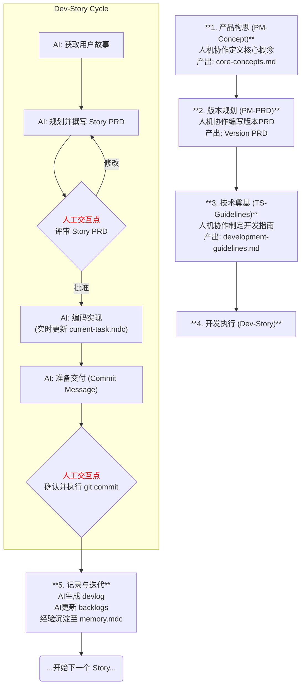

# WaveForge: 一套人机协同的软件开发方法论

欢迎来到 `WaveForge`！这是一个专为**人类与AI开发者协作**而设计的、高度结构化的软件开发工作流。它不仅仅是一系列工具或文件的集合，更是一种"编程氛围"(Coding Vibe)——一种旨在通过**结构化、透明化、可审计且持续优化**的流程，最大限度地发挥人机协作潜力的工作方式。

本项目的核心思想是：将复杂的软件开发过程分解为一系列定义清晰的角色、遵循标准模板的文档产出，以及由精确规则驱动的AI行为，从而实现高效、高质量的开发迭代。

## 核心理念

- **结构化 (Structured)**: 所有开发活动都遵循预定义的流程和模板，从产品构思到代码实现，每一步都有章可循。
- **透明化 (Transparent)**: AI的工作状态和计划在 `current-task.mdc` 文件中实时可见，人类协作者可以随时了解其进展。
- **协同性 (Collaborative)**: 在关键节点（如PRD评审、代码提交）设置了明确的人机交互"关卡"，确保AI的自主性与人类的监督指导完美结合。
- **文档驱动 (Document-Driven)**: 开发过程即文档生成过程。系统会产出一系列高质量、相互关联的文档（如PRD、开发指南、开发日志），形成宝贵的知识库。
- **自优化 (Self-Improving)**: 内置了反思与记忆更新机制，使得这套工作流能够从每一次的开发实践中学习并不断完善。

## 项目构成

`WaveForge` 主要由三大支柱构成，它们共同定义了整个工作流。这些配置文件默认存放在 `.cursor-zh` 目录下。

### 1. 角色 (Roles)

`roles/` 目录定义了参与工作流的不同"人格"及其行为准则，主要用于指导AI在特定情境下的交互模式和目标。

- **`role-pm-core-concepts.md`**: AI作为产品经理的伙伴，与用户协作定义产品的**核心概念、理念和原则**。
- **`role-pm-version-prd.md`**: AI继续扮演产品经理，与用户协作编写一份详尽的**版本产品需求文档 (Version PRD)**，并将宏观目标分解为用户故事。
- **`role-ts-development-guidelines.md`**: AI化身技术伙伴，与用户共同创建项目的**开发指南**。它能够分析现有代码以生成反映现状的草稿，或与用户从零开始制定规范。
- **`role-ai-developer-engineer.md`**: AI作为核心的**开发工程师**，依据PRD和开发指南，自主进行任务规划（生成Story PRD）、编码实现，并在用户的监督下完成代码提交。
- **`role-debugger.md`**: 这并非一个交互式角色，而是一份详尽的**代码调试指南**，为所有开发者（包括AI）提供了系统性的问题排查方法论。

### 2. 模板 (Templates)

`templates/` 目录存放着所有标准产出物的骨架，确保了文档的一致性和完整性。

- **`core-concepts-template.md`**: "核心概念"文档的模板。
- **`version-prd-template.md`**: "版本PRD"的模板。
- **`development-guidelines-template.md`**: 项目"开发指南"的模板，包含了极为详尽的前后端规范。
- **`devlog-template.md`**: "开发日志"的模板，用于记录每个任务的详细过程。
- **`story-prd-template.md`**: "用户故事PRD"的模板，用于记录每个用户故事的详细过程。

### 3. 规则 (Rules)

`rules/` 目录包含一系列特殊的 `.mdc` 文件，它们是驱动AI行为的底层规则和状态机。

- **`project-basic-info.mdc`**: 存储项目的基本信息，如文件路径。
- **`memory.mdc`**: AI的"长期记忆"，固化了必须遵守的核心原则和最佳实践。
- **`knowledge-stack.mdc`**: AI的动态知识库，可通过链接或临时摘录的方式为其"装载"完成任务所需的上下文。
- **`workflow-guidelines.mdc`**: 元规则，定义了AI工作的基本循环：定位、遵循角色、参考规则、检查任务。
- **`current-task.mdc`**: AI的"短期记忆"和任务状态机，实时追踪当前任务的目标、计划、步骤和日志。

## 高级工作流程

为了更直观地展示各阶段的依赖关系和人机协作点，下图描绘了 `WaveForge` 的典型工作流程：

一个典型的 `WaveForge` 工作流程文字描述如下：

1.  **产品构思 (PM-Concept)**: 用户与AI（`role-pm-core-concepts`）对话，共同创建 `core-concepts.md` 文档，明确产品的核心价值。
2.  **版本规划 (PM-PRD)**: 接着，用户与AI（`role-pm-version-prd`）合作，基于核心概念制定详细的 `[version]-version-prd.md`，并将其拆解为一系列用户故事。
3.  **技术奠基 (TS-Guidelines)**: 在正式开发前，用户与AI（`role-ts-development-guidelines`）一起，创建或完善 `development-guidelines.md`，为项目制定统一的技术标准。
4.  **开发执行 (Dev-Story)**:
    - AI工程师（`role-ai-developer-engineer`）承担一个用户故事。
    - **规划**: 它首先分析代码库，并撰写一份详细的 **Story PRD**，列出具体的实施方案，然后交由用户评审。
    - **执行**: Story PRD批准后，AI开始编码。它会实时更新 `current-task.mdc` 来追踪自己的进度。
    - **交付**: 编码和自测完成后，AI会准备好`git commit`信息，并**请求用户执行提交操作**。
5.  **记录与迭代**: 任务完成后，AI会生成一份详细的`devlog`，更新技术债`backlogs`，并准备好开始下一个故事。整个流程中的经验教训可以被沉淀到`memory.mdc`或开发指南中，实现持续改进。

## 如何开始？

1.  **初始化配置**: 将 `.cursor-zh` 目录复制到你的项目根目录。
2.  **定义核心概念**: 尝试与Cursor对话，让它扮演 `role-pm-core-concepts` 角色，开始定义你的产品。
3.  **遵循流程**: 按照上述工作流程，逐步创建PRD、开发指南，并让AI进行开发。

---

希望这套 `WaveForge` 方法论能为你和你的AI伙伴带来更丝滑、更高效的协作体验！ 