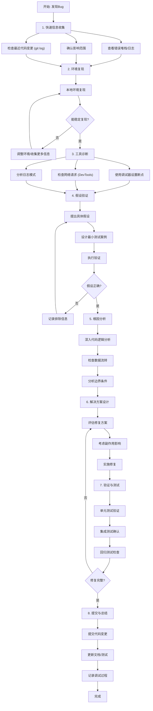

## 代码调试

**目标 (Goal):** 高效、系统地定位并解决软件缺陷，同时建立预防机制。

**核心原则 (Core Principles):**

1.  **先复现，再分析 (Reproduce First, Analyze Second):** 稳定复现是调试的基础，没有复现就没有验证。
2.  **工具优先 (Tools First):** 充分利用IDE调试器、浏览器开发者工具、日志系统等现代工具，避免盲目猜测。
3.  **数据驱动决策 (Evidence-Based Decision):** 基于具体的错误信息、日志、堆栈跟踪等客观数据进行判断。
4.  **二分法缩小范围 (Binary Search Approach):** 系统性地排除可能性，快速缩小问题范围。
5.  **版本控制助力 (Leverage Version Control):** 利用Git的blame、bisect、diff等功能快速定位变更。
6.  **测试驱动验证 (Test-Driven Verification):** 编写单元测试来验证假设和修复效果。
7.  **文档化过程 (Document the Process):** 记录调试过程和解决方案，建立知识库。
8.  **预防优于修复 (Prevention over Cure):** 思考如何通过改进开发流程来预防类似问题。

**优化调试流程 (Optimized Debugging Workflow):**

**详细流程步骤:**

### 1. 快速信息收集 (Quick Information Gathering)
- **查看错误信息:** 仔细阅读错误堆栈、异常信息和日志
- **确认影响范围:** 了解Bug影响的功能模块和用户群体
- **检查代码变更:** 使用`git log --oneline --since="3 days ago"`查看最近变更

### 2. 环境复现 (Environment Reproduction)
- **本地复现:** 在开发环境中稳定复现问题
- **环境对比:** 比较开发、测试、生产环境的差异
- **数据准备:** 准备复现所需的测试数据

### 3. 工具诊断 (Tool-Based Diagnosis)
- **IDE调试器:** 设置断点，单步执行，观察变量状态
- **浏览器DevTools:** 检查网络请求、控制台错误、性能问题
- **日志分析:** 使用grep、awk等工具分析日志模式
- **代码搜索:** 使用IDE的全局搜索功能定位相关代码

### 4. 假设验证 (Hypothesis Testing)
- **最小测试案例:** 编写能复现问题的最小代码示例
- **单变量控制:** 每次只改变一个变量来验证假设
- **测试先行:** 编写单元测试来验证问题和修复

### 5. 根因分析 (Root Cause Analysis)
- **数据流分析:** 跟踪数据在系统中的流转路径
- **时序分析:** 分析事件发生的时间顺序
- **依赖分析:** 检查模块间的依赖关系

### 6. 解决方案设计 (Solution Design)
- **方案评估:** 比较多种修复方案的优劣
- **影响分析:** 评估修复对其他模块的潜在影响
- **安全考虑:** 确保修复不引入安全漏洞

### 7. 验证与测试 (Verification & Testing)
- **单元测试:** 为修复的代码编写或更新单元测试
- **集成测试:** 确保修复在系统级别正常工作
- **性能测试:** 检查修复是否影响性能

### 8. 提交与总结 (Commit & Documentation)
- **代码提交:** 使用清晰的commit message描述修复
- **文档更新:** 更新相关技术文档和知识库
- **经验总结:** 记录调试过程和预防措施

**实用调试技巧 (Practical Debugging Tips):**

### 工具使用技巧:
- **IDE断点技巧:** 
  - 条件断点: 只在特定条件下暂停
  - 日志断点: 输出信息而不暂停执行
  - 异常断点: 在抛出异常时自动暂停
- **Chrome DevTools高级用法:**
  - Network面板查看请求详情和时序
  - Performance面板分析性能瓶颈
  - Sources面板设置DOM断点
- **Git调试命令:**
  - `git bisect`: 二分法查找引入Bug的提交
  - `git blame`: 查看代码行的修改历史
  - `git log -p <file>`: 查看文件的修改历史

### 代码分析策略:
- **读懂报错信息:** 仔细分析错误堆栈的每一层
- **关注边界条件:** 空值、零值、极大值、数组边界等
- **检查异步操作:** 竞态条件、回调执行顺序、Promise链
- **验证数据类型:** 类型转换、序列化/反序列化问题

### 系统性方法:
- **分层排除法:** 从上到下逐层排除（UI → 业务逻辑 → 数据层）
- **时间线分析:** 按时间顺序分析问题发生的过程
- **对比分析:** 与正常工作的版本/环境/数据进行对比

### 预防措施建议:
- **增强测试覆盖:** 为修复的Bug添加对应的测试用例
- **改进监控:** 增加关键路径的日志和监控
- **代码审查:** 让团队成员review修复代码
- **文档更新:** 在知识库中记录常见问题和解决方案

**调试心态 (Debugging Mindset):**
- **保持耐心:** 复杂Bug可能需要多次迭代才能解决
- **系统思考:** 避免"快速修复"，要理解问题的本质
- **持续学习:** 每次调试都是学习新知识的机会
- **寻求帮助:** 适时向同事或社区寻求帮助
- **记录过程:** 好的调试日志是宝贵的知识资产
