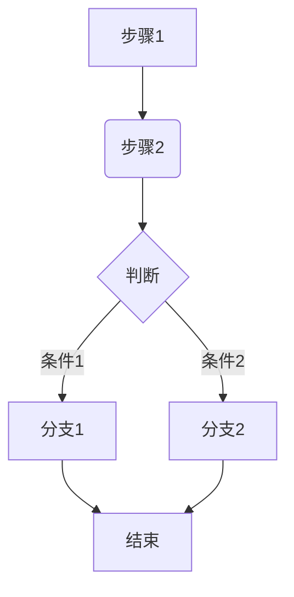

> 文件命名格式模板: [project-name]-[prd-version]-version-prd.md
> 文件路径: docs/product/prd/[prd-version]/

# [项目/功能名称] - Version PRD

**PRD 版本**: v0
**文档版本**: 1.0
**更新时间**: [YYYY-MM-DD]
**作者**: [你的名字/AI 助手]
**状态**: [草稿/评审中/已定稿]

## 1. 背景与目标 (Background & Goals)

### 1.1 项目背景
*   [简述项目的起源、要解决的问题、市场机会或用户痛点。]

### 1.2 版本目标
*   [明确本次版本要达成的具体、可衡量的目标 (SMART)。]
*   **范围 (Scope):**
    *   **In-Scope:** [列出本次版本包含的核心功能范围。]
    *   **Out-of-Scope:** [明确本次版本不包含的内容，防止范围蔓延。]

### 1.3 核心用户价值
*   [阐述该版本为目标用户提供的核心价值。]

## 2. 宏观设计 (Macro Design)

### 2.1 产品定位与平台 (Positioning & Platform)
*   [描述产品在市场中的位置、目标用户群体以及目标运行平台（Web, Desktop, Mobile等）。]

### 2.2 核心流程 (Core Flow)
*   [使用 Mermaid 绘制核心用户旅程或业务流程图，展示主要交互路径。]

### 2.3 技术架构概览 (Tech Architecture Overview)
*   [简述主要技术选型（前端、后端、关键库/框架），强调与之前版本的变化（若有）。例如：前端采用 React+Vite+Tailwind, 后端采用 FastAPI (作为 Piston 代理)。]

### 2.4 关键指标 (Key Metrics)
*   [列出用于衡量版本成功的关键指标。]
*   [区分过程指标（如：代码执行次数）和结果指标（如：题目通过率）。]

## 3. 版本规划 (Planning)

### 3.1 [开发阶段与时间估算 (可选)]
*   [如果需要，可将版本开发分解为主要阶段（如：基础搭建、核心功能开发、测试与发布）并估算大致时间。]

### 3.2 核心用户故事 (Key User Stories)
*   [列出驱动本版本开发的核心用户故事，并标注是否完成。格式建议：**作为 [用户类型], 我想要 [完成某事], 以便 [获得某种价值]。**]
*   [Story 1: ... (Done/TODO)]
*   [Story 2: ... (Done/TODO)(Ref Debt: ...)]
*   [...]

## 4. 概要设计 (Outline Design)

*   [对版本包含的功能进行结构化概览，通常为 Story PRD 的详细设计提供索引。]

### 4.1 [模块设计 (Module Design - 可选)]
*   [如果系统复杂度较高，可将版本拆分为主要的功能模块。]

### 4.2 功能清单 (Feature List)
*   [基于核心用户故事，详细列出本版本计划实现的所有功能点。]
*   [可按模块或用户故事组织。]

### 4.3 [页面结构/信息架构 (Page Structure / Information Architecture]
*   [描述主要页面及其组织关系，可用列表或简单的树状图表示。]

## 5. 交付设计 (Delivery Design)

### 5.1 数据分析设计 (Data Analytics Design)
*   **埋点需求 (Tracking Points):** [列出需要新增或更新的关键用户行为埋点，说明事件名称、触发时机、关键属性。]
*   **报表需求 (Reporting Needs):** [描述需要关注的核心数据报表或指标看板。]

### 5.2 上线筹备 (Deployment Preparation)
*   [列出上线前需要考虑的事项：如环境配置、数据迁移（若有）、依赖协调、回滚预案等。]
*   [识别潜在风险。]

## 6. 技术债务管理 (Tech Debt Management)

*   [记录在本版本开发过程中，因进度、资源限制或其他原因引入的技术债务。]
*   [格式建议: `- [问题描述]: [产生原因] - [建议偿还时机/方案]`]
*   [也可引用代码中的 `// TODO: Tech Debt - ...` 标记。]
*   [说明预留的接口或未来的优化方向。]

## 7. 未来展望 (Future Considerations)

*   [简述当前版本成功交付后，产品可能的下一步演进方向、待探索的功能或优化点。]

## 8. 附录 (Appendix)

*   **相关文档链接 (Related Links):**
    *   [链接到原型图、设计稿、相关 Story PRD、技术文档等。]
*   **术语表 (Glossary):**
    *   [定义项目中关键、特定或易混淆的术语。]
*   **版本历史 (Revision History):**
    | 版本  | 更新时间   | 修改描述       | 修改人 |
    | ----- | -------- | ------------ | ---- |
    | 1.0   | [日期]    | 初始创建       | [名字] |
    | ...   | ...      | ...          | ...  |
