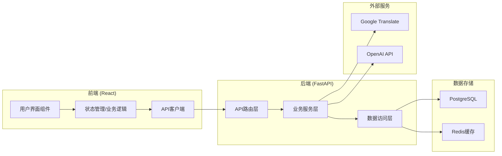

# Strands AI翻译工具 - 开发指南

**版本**: 1.0
**最后更新**: 2024-07-04
**作者**: 开发团队
**状态**: 草稿

## 1. 引言 (Introduction)

### 1.1 文档目的
本文档定义了Strands AI翻译工具开发所遵循的核心架构原则、设计模式和开发规范。旨在确保代码的一致性、可维护性、可测试性和可扩展性，为所有团队成员（包括AI协作者）提供统一的开发标准，降低沟通成本，提高开发效率和产品质量。

### 1.2 项目概览
Strands是一个专业翻译质量控制工具，采用Web应用架构，以SaaS服务模式提供服务。项目目标是辅助专业翻译人员快速提升翻译质量，通过系统化的双语文本处理和精确对照检查，实现高效的翻译质量控制流程。

**核心技术栈**：
- **前端**: React 18+ + TypeScript + Tailwind CSS + Vite
- **后端**: FastAPI + SQLAlchemy + PostgreSQL + Redis  
- **外部服务**: Google Translate API + OpenAI API
- **部署**: Web应用，SaaS服务模式

## 2. 通用指南 (Common Guidelines)

### 2.1 核心架构原则 (High-Level Architecture Principles)

**架构目标**（按优先级排序）：
1. **简洁性与可读性 (Simplicity & Readability)**: 代码应易于理解，优先选择简单直接的实现，便于快速迭代和维护
2. **一致性 (Consistency)**: 遵循统一的代码风格、命名规范和设计模式，使用代码风格工具确保统一
3. **可测试性 (Testability)**: 架构设计应支持单元、集成和端到端测试，通过依赖注入和模块解耦实现
4. **可维护性 (Maintainability)**: 清晰的模块划分、职责分离、完善的文档化，降低修改和扩展成本
5. **可扩展性 (Scalability/Extensibility)**: 模块化设计、接口预留，适应未来功能扩展和用户增长需求

**高层架构图**：



**架构说明**：
- **前端**：采用组件化设计，状态管理集中处理，API调用统一封装
- **后端**：分层架构，路由层处理HTTP请求，业务层处理核心逻辑，数据层负责持久化
- **数据存储**：PostgreSQL作为主数据库，Redis用于缓存和会话管理
- **外部服务**：通过服务层统一管理第三方API调用

### 2.2 设计模式 (Design Patterns)

**前端设计模式**：
- **组件化模式**: 构建可复用的UI组件，遵循单一职责原则
- **容器/展示组件模式**: 分离业务逻辑和UI展示，提高组件可测试性
- **自定义Hook模式**: 封装业务逻辑和状态管理，实现逻辑复用

**后端设计模式**：
- **依赖注入模式**: 通过依赖注入实现模块解耦，便于单元测试
- **仓储模式**: 数据访问层抽象，隔离业务逻辑和数据存储细节
- **服务层模式**: 业务逻辑封装，提供清晰的业务接口

### 2.3 编码规范 (Coding Standards)

**通用规范**：
- **命名规范**: 使用有意义的英文命名，遵循各语言的命名约定（camelCase/PascalCase/snake_case）
- **注释规范**: 关键业务逻辑必须有注释，所有API接口必须有完整文档
- **错误处理**: 实现统一的错误处理机制，提供用户友好的错误提示
- **代码格式化**: 使用Prettier（前端）和Black（后端）自动格式化代码

### 2.4 测试策略 (Testing Strategy)

**测试层次**：
1. **单元测试**: 核心算法（精确对照检查、文本预处理）必须有单元测试覆盖
2. **集成测试**: API接口、数据库操作和外部服务集成测试
3. **端到端测试**: 关键用户流程测试（文档上传→翻译→校对→网页生成）

**测试覆盖率目标**：
- 核心业务逻辑: >80%
- 整体代码覆盖率: >60%
- API接口: 100%

**测试工具**：
- 前端: Jest + React Testing Library + Cypress
- 后端: pytest + pytest-asyncio + httpx

## 3. 前端开发规范 (Frontend Guidelines)

### 3.1 技术栈与工具

**核心技术**：
- React 18+ (用户界面框架)
- TypeScript (类型安全)
- Tailwind CSS (样式框架)
- Vite (构建工具)
- React Router (路由管理)
- React Query (服务器状态管理)

### 3.2 项目结构

```
frontend/
├── src/
│   ├── components/          # 可复用组件
│   │   ├── ui/             # 基础UI组件 (Button, Input, Modal等)
│   │   └── business/       # 业务组件 (TranslationEditor, ReviewPanel等)
│   ├── pages/              # 页面组件
│   │   ├── translator/     # 翻译人员页面
│   │   └── reviewer/       # 审核者页面
│   ├── hooks/              # 自定义Hook
│   ├── services/           # API服务和外部服务调用
│   ├── types/              # TypeScript类型定义
│   ├── utils/              # 工具函数
│   └── styles/             # 全局样式
├── public/                 # 静态资源
└── tests/                  # 测试文件
```

### 3.3 组件设计规范

**组件分类**：
- **UI组件**: 纯展示组件，无业务逻辑，高度可复用
- **业务组件**: 包含特定业务逻辑的组件，如翻译编辑器
- **页面组件**: 路由对应的页面级组件，组合多个业务组件

**组件命名规范**：
- 使用PascalCase命名：`TranslationWorkspace.tsx`
- 文件名与组件名保持一致
- Hook使用use前缀：`useTranslationEditor.ts`

**组件结构模板**：
```typescript
interface ComponentProps {
  // 定义props类型
}

export const ComponentName: React.FC<ComponentProps> = ({ prop1, prop2 }) => {
  // 组件逻辑
  return (
    <div className="tailwind-classes">
      {/* JSX内容 */}
    </div>
  );
};
```

### 3.4 状态管理策略

**本地状态**: 使用React内置的useState/useReducer处理组件内部状态
**全局状态**: 使用Context API + useReducer处理跨组件共享状态
**服务器状态**: 使用React Query进行API数据缓存、同步和错误处理

### 3.5 样式规范

**Tailwind CSS使用规范**：
- 优先使用Tailwind工具类进行样式设置
- 复杂或重复的样式组合使用@apply指令封装
- 组件特定样式放在组件文件中，避免全局样式污染
- 响应式设计使用Tailwind的响应式前缀

**样式示例**：
```typescript
// 优先使用工具类
<div className="flex items-center justify-between p-4 bg-white rounded-lg shadow-md">

// 复杂样式使用@apply
<div className="translation-editor">
  /* styles.css */
  .translation-editor {
    @apply flex flex-col h-full bg-gray-50 border border-gray-200 rounded-lg;
  }
</div>
```

## 4. 后端开发规范 (Backend Guidelines)

### 4.1 技术栈与工具

**核心技术**：
- FastAPI (Python Web框架)
- SQLAlchemy (ORM)
- PostgreSQL (主数据库)
- Redis (缓存和会话管理)
- Pydantic (数据验证)
- Alembic (数据库迁移)

### 4.2 项目结构

```
backend/
├── app/
│   ├── api/                # API路由层
│   │   ├── v1/            # API版本控制
│   │   │   ├── endpoints/ # 具体端点实现
│   │   │   └── __init__.py
│   │   └── dependencies/   # 依赖注入
│   ├── core/              # 核心配置
│   │   ├── config.py      # 应用配置
│   │   ├── security.py    # 安全相关
│   │   └── database.py    # 数据库连接
│   ├── models/            # SQLAlchemy数据模型
│   ├── schemas/           # Pydantic数据模式
│   ├── services/          # 业务逻辑服务层
│   │   ├── translation.py # 翻译服务
│   │   ├── alignment.py   # 对照检查服务
│   │   └── document.py    # 文档处理服务
│   ├── utils/             # 工具函数
│   └── main.py           # FastAPI应用入口
├── tests/                 # 测试文件
├── alembic/              # 数据库迁移文件
└── requirements.txt       # 依赖管理
```

### 4.3 数据库设计规范

**核心表结构**：
- **users**: 用户信息（翻译人员、审核者）
- **projects**: 翻译项目管理
- **documents**: 原始文档信息
- **translations**: 翻译内容和版本
- **reviews**: 审核记录和批注
- **alignment_checks**: 对照检查结果

**命名规范**：
- 表名使用复数形式，snake_case命名
- 字段名使用snake_case命名
- 外键字段使用`{table}_id`格式

### 4.4 API设计规范

**RESTful API规范**：
- 使用标准HTTP方法（GET, POST, PUT, DELETE）
- URL路径使用复数名词：`/api/v1/projects/`
- 版本控制：`/api/v1/`
- 统一的请求/响应格式

**API响应格式**：
```python
# 成功响应
{
    "success": true,
    "data": {...},
    "message": "操作成功",
    "code": 200
}

# 错误响应
{
    "success": false,
    "error": "错误详情",
    "message": "用户友好的错误信息",
    "code": 400
}
```

### 4.5 服务层设计

**核心服务模块**：
- **TranslationService**: 集成Google Translate和OpenAI API
- **AlignmentService**: 实现精确对照检查算法
- **DocumentService**: 文本预处理和格式标准化
- **ReviewService**: 审核流程和批注管理
- **UserService**: 用户认证和权限管理

**服务层模式**：
```python
class TranslationService:
    def __init__(self, db: Session, google_client, openai_client):
        self.db = db
        self.google_client = google_client
        self.openai_client = openai_client
    
    async def translate_document(self, document_id: int) -> TranslationResult:
        # 业务逻辑实现
        pass
```

### 4.6 错误处理规范

**异常处理层次**：
- 业务逻辑异常：自定义业务异常类
- 数据库异常：统一的数据库错误处理
- 外部服务异常：API调用失败处理
- 系统异常：未预期错误的兜底处理

**自定义异常示例**：
```python
class TranslationError(Exception):
    def __init__(self, message: str, code: int = 400):
        self.message = message
        self.code = code
        super().__init__(self.message)
```

## 5. 部署与维护 (Deployment & Maintenance)

### 5.1 开发环境配置

**前端开发环境**：
```bash
# 安装依赖
npm install

# 启动开发服务器
npm run dev

# 运行测试
npm run test
```

**后端开发环境**：
```bash
# 创建虚拟环境
python -m venv venv
source venv/bin/activate  # Linux/Mac
# venv\Scripts\activate   # Windows

# 安装依赖
pip install -r requirements.txt

# 启动开发服务器
uvicorn app.main:app --reload

# 运行测试
pytest
```

### 5.2 代码质量保证

**代码检查工具**：
- 前端：ESLint + Prettier + TypeScript
- 后端：Black + isort + mypy + flake8

**Git提交规范**：
- 使用约定式提交格式：`type(scope): description`
- 类型：feat, fix, docs, style, refactor, test, chore
- 示例：`feat(translation): add Google Translate integration`

### 5.3 CI/CD流程

**持续集成检查**：
1. 代码格式检查
2. 单元测试执行
3. 集成测试执行
4. 代码覆盖率检查

**部署流程**：
1. 开发分支合并到main
2. 自动化测试通过
3. 构建Docker镜像
4. 部署到测试环境
5. 人工验收测试
6. 部署到生产环境

## 6. 总结 (Summary)

### 6.1 关键原则回顾

1. **简洁性优先**：保持代码简单易懂，便于快速迭代
2. **一致性保证**：统一的代码风格和设计模式
3. **质量保障**：完善的测试覆盖和代码检查
4. **模块化设计**：清晰的分层架构和职责分离
5. **文档完善**：代码注释和API文档齐全

### 6.2 开发流程

1. **需求分析**：基于Story PRD进行详细设计
2. **编码实现**：遵循本指南的规范和模式
3. **测试验证**：单元测试、集成测试、端到端测试
4. **代码审查**：确保代码质量和规范遵循
5. **部署上线**：通过CI/CD流程自动化部署

### 6.3 持续改进

本开发指南将随着项目发展持续更新和完善，团队成员应定期回顾和讨论改进建议。

---

**文档状态**: 已定稿  
**下一步**: 基于开发指南开始Story PRD编写和具体开发工作
