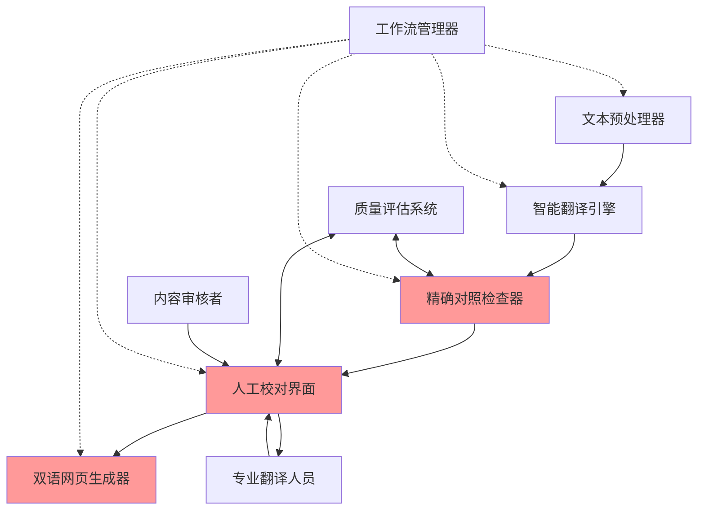

# Strands AI翻译工具 - 核心概念文档

## 文档信息
- **创建日期**: 2024-07-04
- **作者**: 产品团队
- **状态**: 草稿
- **版本**: v0.1

## 产品概述

Strands是一个智能化的双语文本处理工具，旨在将复杂的双语文本处理工作自动化和智能化，让用户能够轻松创建高质量的双语对照材料。该工具在机器翻译的基础上引入人工校对环节，让专业翻译人员可以方便地对照、核查、纠错，最终生成精确对照的双语网页。

## 核心理念 (Core Philosophy)

### 1. 精确对照优先 (Precision Alignment First)
确保英文和中文文本实现完美的1:1行对应关系，这是高质量双语对照材料的基础。

### 2. 质量可控 (Quality Controllable)  
采用人机协作模式，在关键节点设置人工确认环节，确保翻译质量和准确性。

### 3. 流程标准化 (Process Standardization)
建立系统化的处理流程，从文本预处理到最终网页生成，每个环节都有明确的标准和检查机制。

## 核心原则 (Core Principles)

### 1. 专业翻译人员中心 (Translator-Centric)
工具设计以专业翻译人员的工作流程为中心，提供便捷的对照、核查、纠错功能。

### 2. 机器辅助，人工决策 (AI-Assisted, Human-Decided)
机器负责初步处理和检测，重要决策和质量把控由人工完成。

### 3. 可追溯性 (Traceability)
整个处理过程可追溯，记录每个环节的操作和修改，便于质量管理和问题排查。

### 4. 标准化输出 (Standardized Output)
生成符合标准的双语对照网页，具备良好的用户体验和可读性。

## 核心概念 (Core Concepts)

基于产品理念和实际需求，我们识别出以下核心概念，其中**精确对照**、**人工校对**和**双语网页生成**是最关键的三个核心概念：

### 优先级分类：
- **核心概念 (Core)**: 精确对照检查器、人工校对界面、双语网页生成器
- **支撑概念 (Supporting)**: 文本预处理器、智能翻译引擎、质量评估系统、工作流管理器

### 用户角色：
- **专业翻译人员**: 负责翻译质量的核心执行者
- **内容审核者**: 负责译文标注、评价和最终质量把关

## 核心概念详解 (Core Concepts Details)

### 1. 精确对照检查器 (Precision Alignment Checker) ⭐

**定义**: 一个自动化系统，能够逐行检查英文和中文文本的对应关系，确保实现完美的1:1行对应，并自动检测和报告各种对齐问题。

**关键特性**:
- 逐行对照验证算法
- 自动检测对话合并、内容缺失、段落分割错误等问题
- 提供具体的问题定位和修复建议
- 支持章节结构验证和内容完整性检查

**示例应用**:
- 检测"两个独立对话被合并在一行"的问题
- 发现"某行翻译完全缺失"的情况
- 验证章节数量和行数匹配

### 2. 人工校对界面 (Human Review Interface) ⭐

**定义**: 为专业翻译人员设计的工作台，提供便捷的双语文本对照、编辑、标注功能，支持高效的翻译质量控制工作流程。

**关键特性**:
- 左右对照的双语文本显示
- 行级别的编辑和修改功能
- 问题标记和注释系统
- 与内容审核者的协作功能
- 修改历史追踪

**示例应用**:
- 翻译人员可以看到机器翻译结果和原文的精确对照
- 可以直接编辑有问题的翻译行
- 可以查看审核者的标注和反馈
- 支持实时保存和版本管理

### 3. 双语网页生成器 (Bilingual Webpage Generator) ⭐

**定义**: 一个自动化系统，将经过精确对照和人工校对的双语文本转换为具备良好用户体验的双语对照网页，支持响应式设计和交互功能。

**关键特性**:
- 左右对照的双语布局生成
- 响应式设计，适配不同设备
- 章节导航和进度指示功能
- 人物关系图等增强功能的集成
- 搜索和字体调节等用户体验优化
- 标准化的HTML/CSS输出

**示例应用**:
- 自动生成类似《真正的朋友》项目的双语对照网页
- 支持章节跳转和阅读进度追踪
- 集成人物关系图和其他辅助阅读功能
- 生成可直接部署的静态网页文件

### 4. 文本预处理器 (Text Preprocessor)

**定义**: 负责原始文本的格式检查、清理和标准化处理，为后续翻译和对照工作奠定基础。

**关键特性**:
- 自动检测编码格式
- 移除多余空行
- 合并错误分割段落
- 统一格式标准

**示例应用**:
- 将423行原始文本清理为375行标准格式
- 识别并修复段落分割错误

### 5. 智能翻译引擎 (Smart Translation Engine)

**定义**: 基于AI的机器翻译系统，提供高质量的初始翻译结果，作为人工校对的起点。

**关键特性**:
- 多模型支持
- 上下文理解
- 专业术语处理
- 批量翻译能力

**示例应用**:
- 为整本小说提供初始机器翻译
- 保持术语翻译的一致性

### 6. 质量评估系统 (Quality Assessment System)

**定义**: 多维度的翻译质量检查和评估机制，提供客观的质量指标和改进建议。

**关键特性**:
- 对齐准确度计算
- 内容完整性评估
- 结构一致性检查
- 翻译覆盖率统计

**示例应用**:
- 计算1:1行对应的准确率
- 评估翻译完整性得分

### 7. 工作流管理器 (Workflow Manager)

**定义**: 简化的流程控制系统，协调各个处理环节的基本执行顺序。

**关键特性**:
- 基本流程编排
- 状态跟踪

**示例应用**:
- 按顺序执行：预处理→翻译→对照→校对→生成
- 跟踪当前处理阶段

## 概念之间的关系 (Relationships Between Concepts)

### 主要数据流和依赖关系：

1. **线性处理流程**：
   文本预处理器 → 智能翻译引擎 → 精确对照检查器 → 人工校对界面 → 双语网页生成器

2. **质量控制循环**：
   质量评估系统 ↔ 精确对照检查器 ↔ 人工校对界面

3. **协作关系**：
   人工校对界面 ↔ 内容审核者反馈 ↔ 专业翻译人员

4. **统一协调**：
   工作流管理器协调所有组件

### 概念关系图：

**关系说明**：
- **实线箭头**：主要数据流和处理顺序
- **双向箭头**：交互和反馈关系
- **虚线箭头**：协调和管理关系
- **红色高亮**：核心概念

## 核心概念在系统中的应用 (Application of Core Concepts in System)

### 主要功能模块：

#### 1. 文档管理模块 (Document Management Module)
**应用的核心概念**: 文本预处理器 + 工作流管理器
**主要功能**: 文件上传、格式检查、项目管理
**概念体现**: 自动检测和清理文本格式，管理处理流程状态

#### 2. 翻译处理模块 (Translation Processing Module)  
**应用的核心概念**: 智能翻译引擎
**主要功能**: 机器翻译、批量处理
**概念体现**: 提供高质量的初始翻译，支持大规模文本处理

#### 3. 对照检查模块 (Alignment Verification Module)
**应用的核心概念**: 精确对照检查器 + 质量评估系统
**主要功能**: 精确对照验证、问题检测
**概念体现**: 实现1:1行对应检查，自动发现和报告对齐问题

#### 4. 协作校对模块 (Collaborative Review Module) ⭐
**应用的核心概念**: 人工校对界面 + 用户角色系统
**主要功能**: 翻译人员和审核者的工作界面
**概念体现**: 支持专业翻译人员校对和内容审核者标注评价的协作流程

#### 5. 质量控制模块 (Quality Control Module)
**应用的核心概念**: 质量评估系统
**主要功能**: 质量评估、统计报告
**概念体现**: 提供多维度质量指标和改进建议

#### 6. 网页生成模块 (Webpage Generation Module) ⭐
**应用的核心概念**: 双语网页生成器
**主要功能**: 双语网页输出、模板管理
**概念体现**: 生成具备良好用户体验的双语对照网页

## 总结 (Summary)

Strands AI翻译工具通过七个核心概念的有机结合，实现了从原始文本到高质量双语对照网页的完整处理流程：

### 核心价值链：
1. **文本预处理器**确保输入质量
2. **智能翻译引擎**提供翻译基础
3. **精确对照检查器**保证对齐质量 ⭐
4. **人工校对界面**实现质量控制 ⭐  
5. **双语网页生成器**产出最终成果 ⭐

### 质量保障体系：
- **质量评估系统**提供客观评估
- **工作流管理器**确保流程规范
- **协作机制**支持专业翻译人员与内容审核者的高效配合

### 设计原则体现：
- **精确对照优先**：通过精确对照检查器实现
- **质量可控**：通过人工校对界面和协作机制实现
- **流程标准化**：通过工作流管理器和质量评估系统实现

这套核心概念框架为产品的技术架构设计和功能实现提供了清晰的指导方向。

---

## 文档状态更新
- **最后更新**: 2024-07-04
- **状态**: 已完成
- **版本**: v1.0
- **下一步**: 基于核心概念编写版本PRD
