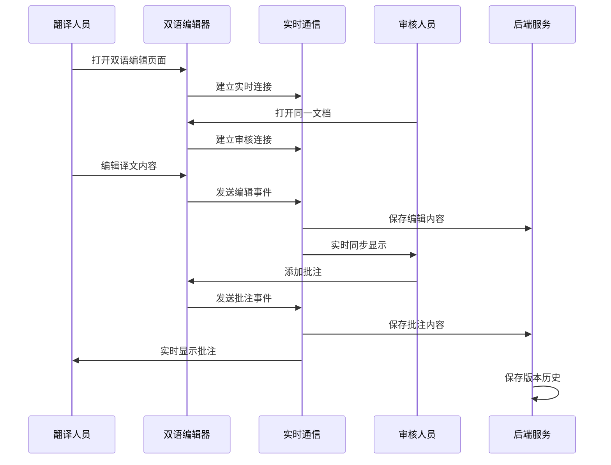

# 故事10: 双语网页生成系统 - Story PRD

**版本**: 0.1
**更新时间**: 2024-07-04
**作者**: AI开发工程师
**状态**: 草稿
**关联 Version PRD**: [docs/product/prd/v1.0/strands-v1.0-version-prd.md](../strands-v1.0-version-prd.md)

## 1. 用户故事定义 (User Story Definition)

**用户故事 (Story):**
> 作为系统，我需要生成双语对照网页，以便提供最终交付物

**验收标准 (Acceptance Criteria):**
- [AC-1] 系统能够接收经过预处理的双语文本数据
- [AC-2] 系统能够生成左右对照的可编辑双语网页
- [AC-3] 翻译人员能够直接在网页上实时编辑译文内容
- [AC-4] 审核人员能够实时查看翻译人员的修改效果
- [AC-5] 审核人员能够对译文进行批注和评论
- [AC-6] 系统能够自动检测和生成章节导航
- [AC-7] 系统能够生成响应式设计，适配不同设备
- [AC-8] 系统能够支持实时协作，多用户同时在线编辑
- [AC-9] 系统能够保存编辑历史和版本控制
- [AC-10] 系统能够集成搜索功能和用户体验优化

## 2. 实施方案设计 (Proposed Implementation Design)

基于核心概念文档中的双语网页生成器定义和用户补充的**可编辑协作需求**，本系统将实现完整的**动态双语协作编辑平台**，而非静态网页生成。

### 2.1 涉及的组件/模块 (Affected Components/Modules)

**后端服务层 (`backend/app/services/`)**:
- `webpage_generator.py`: 核心网页生成服务
- `collaboration_manager.py`: 实时协作管理服务
- `edit_tracker.py`: 编辑历史和版本控制服务
- `comment_system.py`: 批注和评论系统服务
- `websocket_handler.py`: WebSocket实时通信处理

**前端组件 (`frontend/src/components/business/`)**:
- `BilingualEditor.tsx`: 可编辑双语对照组件
- `CommentPanel.tsx`: 批注和评论面板
- `CollaborationIndicator.tsx`: 实时协作状态指示器
- `VersionHistory.tsx`: 版本历史查看组件

**实时通信 (`backend/app/websocket/`)**:
- `collaboration_ws.py`: 协作WebSocket端点
- `edit_events.py`: 编辑事件处理
- `notification_ws.py`: 实时通知系统

**数据模型 (`backend/app/schemas/`)**:
- `collaboration.py`: 协作相关数据模式
- `edit_history.py`: 编辑历史数据模式
- `comments.py`: 批注系统数据模式

**API接口 (`backend/app/api/v1/endpoints/`)**:
- `webpages.py`: 网页生成相关API端点

### 2.2 数据获取与流程 (Data Fetching & Flow)

**数据来源**: 经过故事9预处理的双语文本数据
**处理方式**: 动态Web应用，支持实时编辑和协作
**核心流程**:

1. 生成可编辑的双语对照界面
2. 建立WebSocket实时通信连接
3. 处理翻译人员的实时编辑操作
4. 同步显示给审核人员
5. 处理审核人员的批注和评论
6. 保存编辑历史和版本控制

**流程图:**


### 2.3 核心算法设计 (Core Algorithm Design)

**实时编辑算法**:
```python
def handle_edit_event(edit_data: EditEvent) -> EditResponse:
    """
    处理实时编辑事件
    """
    # 验证编辑权限
    if not validate_edit_permission(edit_data.user_id, edit_data.document_id):
        raise PermissionError("无编辑权限")
    
    # 应用编辑操作
    result = apply_edit_operation(
        document_id=edit_data.document_id,
        line_number=edit_data.line_number,
        new_content=edit_data.new_content,
        edit_type=edit_data.edit_type  # 'translation' or 'original'
    )
    
    # 保存编辑历史
    save_edit_history(EditHistory(
        document_id=edit_data.document_id,
        user_id=edit_data.user_id,
        line_number=edit_data.line_number,
        old_content=result.old_content,
        new_content=edit_data.new_content,
        timestamp=datetime.now()
    ))
    
    # 广播给其他协作者
    broadcast_edit_event(edit_data.document_id, result)
    
    return result
```

**批注系统算法**:
```python
def add_comment(comment_data: CommentData) -> Comment:
    """
    添加批注评论
    """
    comment = Comment(
        id=generate_comment_id(),
        document_id=comment_data.document_id,
        line_number=comment_data.line_number,
        author_id=comment_data.author_id,
        content=comment_data.content,
        comment_type=comment_data.comment_type,  # 'suggestion', 'question', 'approval'
        timestamp=datetime.now(),
        status='active'
    )
    
    # 保存批注
    save_comment(comment)
    
    # 实时通知相关用户
    notify_collaborators(comment_data.document_id, comment)
    
    return comment
```

**协作状态管理算法**:
```python
def manage_collaboration_state(document_id: str) -> CollaborationState:
    """
    管理文档协作状态
    """
    active_users = get_active_users(document_id)
    current_editors = get_current_editors(document_id)
    pending_comments = get_pending_comments(document_id)
    
    return CollaborationState(
        document_id=document_id,
        active_users=active_users,
        current_editors=current_editors,
        pending_comments=pending_comments,
        last_activity=get_last_activity(document_id)
    )
```

### 2.4 API接口设计 (API Interface Design)

**POST /api/v1/collaboration/create-session**
```python
class CollaborationSessionRequest(BaseModel):
    document_id: str = Field(..., description="文档ID")
    en_content: str = Field(..., description="英文内容")
    cn_content: str = Field(..., description="中文内容")
    metadata: DocumentMetadata = Field(..., description="文档元数据")

class CollaborationSessionResponse(BaseModel):
    success: bool
    data: Optional[SessionResult] = None
    message: str
    code: int

class SessionResult(BaseModel):
    session_id: str = Field(..., description="协作会话ID")
    webapp_url: str = Field(..., description="协作网页URL")
    websocket_url: str = Field(..., description="WebSocket连接URL")
    permissions: UserPermissions = Field(..., description="用户权限")
```

**WebSocket /ws/collaboration/{session_id}**
```python
class EditEvent(BaseModel):
    event_type: str = Field(..., description="事件类型: edit, comment, cursor")
    document_id: str = Field(..., description="文档ID")
    line_number: int = Field(..., description="行号")
    content: Optional[str] = Field(None, description="编辑内容")
    user_id: str = Field(..., description="用户ID")
    timestamp: datetime = Field(..., description="时间戳")

class CommentEvent(BaseModel):
    event_type: str = "comment"
    document_id: str = Field(..., description="文档ID")
    line_number: int = Field(..., description="行号")
    comment_content: str = Field(..., description="批注内容")
    comment_type: str = Field(..., description="批注类型")
    author_id: str = Field(..., description="作者ID")
```

**GET /api/v1/collaboration/{session_id}/history**
```python
class EditHistoryResponse(BaseModel):
    success: bool
    data: List[EditHistoryItem]
    message: str

class EditHistoryItem(BaseModel):
    id: str
    document_id: str
    line_number: int
    old_content: str
    new_content: str
    user_id: str
    user_name: str
    timestamp: datetime
    edit_type: str  # 'translation', 'original', 'comment'
```

### 2.5 前端组件设计 (Frontend Component Design)

**可编辑双语编辑器组件**:
```typescript
interface BilingualEditorProps {
  documentId: string;
  initialEnContent: string[];
  initialCnContent: string[];
  userRole: 'translator' | 'reviewer';
  onContentChange: (lineNumber: number, content: string, type: 'en' | 'cn') => void;
}

const BilingualEditor: React.FC<BilingualEditorProps> = ({
  documentId,
  initialEnContent,
  initialCnContent,
  userRole,
  onContentChange
}) => {
  const [enLines, setEnLines] = useState(initialEnContent);
  const [cnLines, setCnLines] = useState(initialCnContent);
  const [comments, setComments] = useState<Comment[]>([]);
  const [activeUsers, setActiveUsers] = useState<User[]>([]);
  
  // WebSocket连接管理
  const { socket, isConnected } = useWebSocket(`/ws/collaboration/${documentId}`);
  
  // 实时编辑处理
  const handleLineEdit = (lineNumber: number, newContent: string, type: 'en' | 'cn') => {
    if (userRole !== 'translator' && type === 'cn') {
      toast.error('只有翻译人员可以编辑译文');
      return;
    }
    
    // 发送编辑事件
    socket.emit('edit', {
      event_type: 'edit',
      document_id: documentId,
      line_number: lineNumber,
      content: newContent,
      edit_type: type,
      user_id: currentUser.id
    });
    
    // 本地更新
    if (type === 'en') {
      setEnLines(prev => prev.map((line, idx) => 
        idx === lineNumber ? newContent : line
      ));
    } else {
      setCnLines(prev => prev.map((line, idx) => 
        idx === lineNumber ? newContent : line
      ));
    }
  };
  
  return (
    <div className="bilingual-editor">
      <CollaborationIndicator users={activeUsers} />
      
      <div className="editor-container">
        <div className="english-column">
          <h3>English</h3>
          {enLines.map((line, index) => (
            <EditableLine
              key={`en-${index}`}
              content={line}
              lineNumber={index}
              type="en"
              readOnly={userRole === 'reviewer'}
              onEdit={(content) => handleLineEdit(index, content, 'en')}
              comments={comments.filter(c => c.line_number === index)}
            />
          ))}
        </div>
        
        <div className="chinese-column">
          <h3>中文</h3>
          {cnLines.map((line, index) => (
            <EditableLine
              key={`cn-${index}`}
              content={line}
              lineNumber={index}
              type="cn"
              readOnly={false}
              onEdit={(content) => handleLineEdit(index, content, 'cn')}
              comments={comments.filter(c => c.line_number === index)}
            />
          ))}
        </div>
      </div>
      
      <CommentPanel
        documentId={documentId}
        comments={comments}
        onAddComment={handleAddComment}
        userRole={userRole}
      />
    </div>
  );
};
```

**实时批注组件**:
```typescript
interface CommentPanelProps {
  documentId: string;
  comments: Comment[];
  onAddComment: (lineNumber: number, content: string, type: CommentType) => void;
  userRole: 'translator' | 'reviewer';
}

const CommentPanel: React.FC<CommentPanelProps> = ({
  documentId,
  comments,
  onAddComment,
  userRole
}) => {
  const [selectedLine, setSelectedLine] = useState<number | null>(null);
  const [commentText, setCommentText] = useState('');
  const [commentType, setCommentType] = useState<CommentType>('suggestion');
  
  const handleSubmitComment = () => {
    if (selectedLine !== null && commentText.trim()) {
      onAddComment(selectedLine, commentText, commentType);
      setCommentText('');
      setSelectedLine(null);
    }
  };
  
  return (
    <div className="comment-panel">
      <div className="comment-form">
        <select 
          value={commentType} 
          onChange={(e) => setCommentType(e.target.value as CommentType)}
        >
          <option value="suggestion">建议</option>
          <option value="question">疑问</option>
          <option value="approval">认可</option>
          <option value="correction">纠正</option>
        </select>
        
        <textarea
          value={commentText}
          onChange={(e) => setCommentText(e.target.value)}
          placeholder="添加批注..."
          rows={3}
        />
        
        <button onClick={handleSubmitComment} disabled={!selectedLine}>
          添加批注
        </button>
      </div>
      
      <div className="comments-list">
        {comments.map(comment => (
          <CommentItem
            key={comment.id}
            comment={comment}
            onReply={handleReplyComment}
            onResolve={handleResolveComment}
          />
        ))}
      </div>
    </div>
  );
};
```

### 2.6 实时协作功能 (Real-time Collaboration Features)

**WebSocket事件处理**:
```javascript
// 客户端WebSocket管理
class CollaborationWebSocket {
  constructor(sessionId, userId) {
    this.sessionId = sessionId;
    this.userId = userId;
    this.socket = null;
    this.reconnectAttempts = 0;
    this.maxReconnectAttempts = 5;
  }
  
  connect() {
    this.socket = new WebSocket(`ws://localhost:8000/ws/collaboration/${this.sessionId}`);
    
    this.socket.onopen = () => {
      console.log('协作连接已建立');
      this.reconnectAttempts = 0;
      this.sendUserJoin();
    };
    
    this.socket.onmessage = (event) => {
      const data = JSON.parse(event.data);
      this.handleMessage(data);
    };
    
    this.socket.onclose = () => {
      console.log('协作连接已断开');
      this.attemptReconnect();
    };
  }
  
  sendEditEvent(lineNumber, content, editType) {
    if (this.socket && this.socket.readyState === WebSocket.OPEN) {
      this.socket.send(JSON.stringify({
        event_type: 'edit',
        document_id: this.sessionId,
        line_number: lineNumber,
        content: content,
        edit_type: editType,
        user_id: this.userId,
        timestamp: new Date().toISOString()
      }));
    }
  }
  
  sendCommentEvent(lineNumber, commentContent, commentType) {
    if (this.socket && this.socket.readyState === WebSocket.OPEN) {
      this.socket.send(JSON.stringify({
        event_type: 'comment',
        document_id: this.sessionId,
        line_number: lineNumber,
        comment_content: commentContent,
        comment_type: commentType,
        author_id: this.userId,
        timestamp: new Date().toISOString()
      }));
    }
  }
  
  handleMessage(data) {
    switch (data.event_type) {
      case 'edit':
        this.handleEditEvent(data);
        break;
      case 'comment':
        this.handleCommentEvent(data);
        break;
      case 'user_join':
        this.handleUserJoin(data);
        break;
      case 'user_leave':
        this.handleUserLeave(data);
        break;
      case 'cursor_position':
        this.handleCursorPosition(data);
        break;
    }
  }
  
  handleEditEvent(data) {
    // 更新对应行的内容
    const lineElement = document.getElementById(`line-${data.line_number}`);
    if (lineElement && data.user_id !== this.userId) {
      const targetColumn = data.edit_type === 'en' ? '.english-line' : '.chinese-line';
      const contentElement = lineElement.querySelector(targetColumn);
      if (contentElement) {
        contentElement.textContent = data.content;
        // 添加编辑指示器
        this.showEditIndicator(lineElement, data.user_name);
      }
    }
  }
  
  handleCommentEvent(data) {
    // 显示新批注
    this.addCommentToLine(data.line_number, data);
    // 发送通知
    this.showNotification(`${data.author_name} 添加了批注`, 'info');
  }
}
```

**版本历史管理**:
```javascript
class VersionHistory {
  constructor(documentId) {
    this.documentId = documentId;
    this.history = [];
    this.currentVersion = 0;
  }
  
  async loadHistory() {
    try {
      const response = await fetch(`/api/v1/collaboration/${this.documentId}/history`);
      const data = await response.json();
      this.history = data.data;
      return this.history;
    } catch (error) {
      console.error('加载历史记录失败:', error);
      return [];
    }
  }
  
  showVersionComparison(versionA, versionB) {
    // 显示版本对比界面
    const diffView = new DiffView(versionA, versionB);
    diffView.render();
  }
  
  revertToVersion(versionId) {
    // 恢复到指定版本
    if (confirm('确定要恢复到此版本吗？当前未保存的更改将丢失。')) {
      this.performRevert(versionId);
    }
  }
}
```

## 3. 测试计划 (Testing Plan)

### 3.1 单元测试
- 实时编辑事件处理测试
- 批注系统功能测试
- WebSocket连接管理测试
- 版本历史保存和恢复测试
- 权限控制和安全测试

### 3.2 集成测试
- 前后端协作功能集成测试
- 多用户并发编辑测试
- 实时同步准确性测试
- 数据持久化完整性测试

### 3.3 用户体验测试
- 不同角色用户权限测试
- 实时协作响应速度测试
- 批注系统易用性测试
- 移动端响应式协作测试

### 3.4 性能测试
- 多用户并发协作压力测试
- WebSocket连接稳定性测试
- 大文档实时编辑性能测试
- 网络断线重连机制测试

### 3.4 测试数据
- 基于《真正的朋友》项目的实际双语文本
- 包含多章节结构的测试文档
- 不同长度和复杂度的文本样本

## 4. 性能要求 (Performance Requirements)

- 创建协作会话 < 2秒
- 实时编辑事件延迟 < 100ms
- 支持同时在线协作用户 >= 10人
- WebSocket连接稳定性 > 99%
- 批注加载和显示 < 500ms
- 版本历史查询 < 1秒
- 大文档(>1000行)协作响应时间 < 200ms

## 5. 安全考虑 (Security Considerations)

- 用户身份验证和会话管理
- 编辑权限控制（翻译人员vs审核人员）
- WebSocket连接安全验证
- 批注内容XSS防护
- 版本历史访问权限控制
- 协作会话超时和清理机制
- 敏感数据传输加密

## 6. 技术债务说明 (Technical Debt Notes)

**v1.0 MVP简化实现**：
- 基础的冲突解决机制（后续需要完善OT算法）
- 简化的用户权限系统（后续需要细粒度权限控制）
- 基础的离线处理（后续需要完善离线编辑同步）
- 简单的通知系统（后续需要完善消息推送）

## 7. 部署和监控 (Deployment & Monitoring)

- 协作会话创建成功率监控
- WebSocket连接质量监控
- 实时编辑延迟监控
- 用户协作行为分析
- 系统资源使用监控
- 错误日志和异常追踪

---

**下一步**: 等待用户评审确认后开始具体实现
