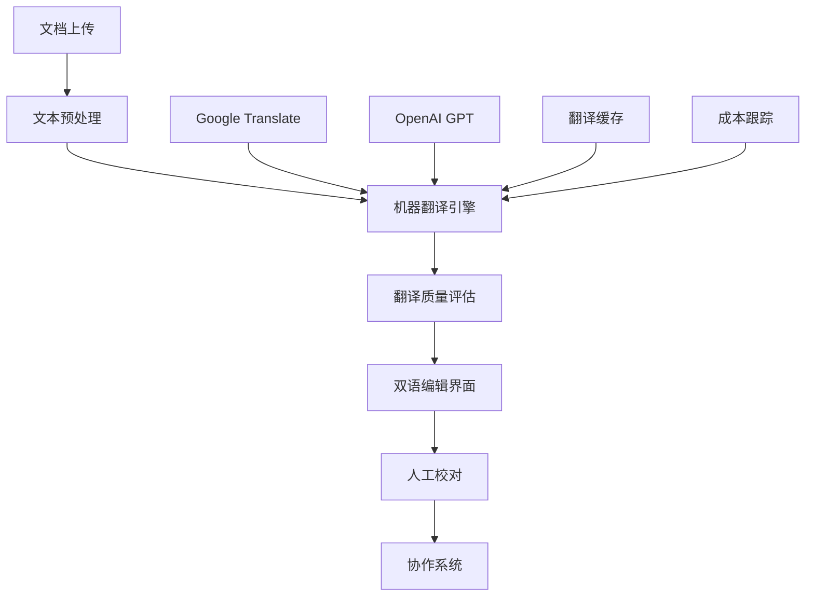

# 故事2: 机器翻译集成 - Story PRD

**版本**: 0.1
**更新时间**: 2024-07-04
**作者**: AI开发工程师
**状态**: 草稿
**关联 Version PRD**: [docs/product/prd/v1.0/strands-v1.0-version-prd.md](../strands-v1.0-version-prd.md)

## 1. 用户故事定义 (User Story Definition)

**用户故事 (Story):**
> 作为翻译人员，我想要看到机器翻译的初始结果，以便作为翻译起点

**验收标准 (Acceptance Criteria):**
- [AC-1] 系统能够集成多个机器翻译服务（Google Translate、OpenAI）
- [AC-2] 翻译人员能够在项目创建时选择是否启用机器翻译
- [AC-3] 系统能够对预处理后的文本进行批量机器翻译
- [AC-4] 翻译人员能够在编辑界面中查看机器翻译结果
- [AC-5] 系统能够提供翻译质量评估和置信度显示
- [AC-6] 翻译人员能够选择接受、修改或拒绝机器翻译建议
- [AC-7] 系统能够支持增量翻译（仅翻译新增或修改的内容）
- [AC-8] 系统能够提供翻译引擎切换和对比功能
- [AC-9] 系统能够记录翻译使用统计和成本控制
- [AC-10] 系统能够处理翻译错误和服务异常情况

## 2. 实施方案设计 (Proposed Implementation Design)

基于核心概念文档中的智能翻译引擎定义，以及已完成的故事9（文本预处理）、故事10（双语协作）和故事3（双语编辑界面），本系统将实现完整的机器翻译集成功能。

### 2.1 涉及的组件/模块 (Affected Components/Modules)

**后端服务层 (`backend/app/services/`)**:
- `translation_engine.py`: 核心翻译引擎服务
- `translation_providers.py`: 翻译服务提供商集成
- `translation_quality.py`: 翻译质量评估服务
- `translation_cache.py`: 翻译结果缓存服务
- `cost_tracker.py`: 翻译成本跟踪服务

**翻译提供商集成 (`backend/app/providers/`)**:
- `google_translate.py`: Google Translate API集成
- `openai_translator.py`: OpenAI GPT翻译集成
- `azure_translator.py`: Azure Translator集成（可选）
- `provider_factory.py`: 翻译提供商工厂

**数据模型 (`backend/app/schemas/`)**:
- `translation.py`: 翻译相关数据模式
- `translation_job.py`: 翻译任务数据模式
- `quality_metrics.py`: 质量评估数据模式

**API接口 (`backend/app/api/v1/endpoints/`)**:
- `translation.py`: 翻译相关API端点

**前端组件 (`frontend/src/components/business/`)**:
- `TranslationAssistant.tsx`: 翻译辅助组件
- `TranslationSuggestions.tsx`: 翻译建议组件
- `QualityIndicator.tsx`: 质量指示器组件
- `ProviderSelector.tsx`: 翻译引擎选择器

### 2.2 系统集成架构 (System Integration Architecture)

**集成已完成的系统**:
1. **故事9 - 文本预处理**: 预处理后的文本作为翻译输入
2. **故事10 - 双语协作**: 翻译结果集成到协作编辑
3. **故事3 - 双语编辑界面**: 翻译辅助功能集成到工作台

**数据流程**:


### 2.3 核心翻译引擎设计 (Core Translation Engine Design)

**翻译引擎架构**:
```python
class TranslationEngine:
    """智能翻译引擎核心类"""
    
    def __init__(self):
        self.providers = {
            'google': GoogleTranslateProvider(),
            'openai': OpenAITranslateProvider(),
            'azure': AzureTranslateProvider()
        }
        self.cache = TranslationCache()
        self.quality_assessor = QualityAssessor()
        self.cost_tracker = CostTracker()
    
    async def translate_batch(
        self, 
        texts: List[str], 
        source_lang: str = 'en',
        target_lang: str = 'zh',
        provider: str = 'google',
        quality_threshold: float = 0.8
    ) -> TranslationResult:
        """批量翻译文本"""
        
        # 1. 检查缓存
        cached_results = await self.cache.get_cached_translations(texts)
        
        # 2. 过滤需要翻译的文本
        texts_to_translate = self._filter_uncached_texts(texts, cached_results)
        
        # 3. 调用翻译服务
        if texts_to_translate:
            provider_instance = self.providers[provider]
            new_translations = await provider_instance.translate_batch(
                texts_to_translate, source_lang, target_lang
            )
            
            # 4. 质量评估
            quality_scores = await self.quality_assessor.assess_batch(
                texts_to_translate, new_translations
            )
            
            # 5. 缓存结果
            await self.cache.cache_translations(
                texts_to_translate, new_translations, quality_scores
            )
            
            # 6. 成本跟踪
            await self.cost_tracker.track_usage(
                provider, len(texts_to_translate), sum(len(t) for t in texts_to_translate)
            )
        
        # 7. 合并结果
        final_results = self._merge_results(cached_results, new_translations)
        
        return TranslationResult(
            translations=final_results,
            quality_scores=quality_scores,
            provider_used=provider,
            cache_hit_rate=len(cached_results) / len(texts)
        )
```

### 2.4 翻译服务提供商集成 (Translation Provider Integration)

**Google Translate集成**:
```python
class GoogleTranslateProvider(BaseTranslationProvider):
    """Google Translate API集成"""
    
    def __init__(self):
        self.client = translate.Client()
        self.max_batch_size = 100
        self.rate_limit = RateLimiter(requests_per_second=10)
    
    async def translate_batch(
        self, 
        texts: List[str], 
        source_lang: str, 
        target_lang: str
    ) -> List[TranslationItem]:
        """批量翻译"""
        results = []
        
        # 分批处理
        for batch in self._create_batches(texts, self.max_batch_size):
            await self.rate_limit.acquire()
            
            try:
                # 调用Google Translate API
                response = self.client.translate(
                    batch,
                    source_language=source_lang,
                    target_language=target_lang
                )
                
                # 处理响应
                for i, item in enumerate(response):
                    results.append(TranslationItem(
                        original_text=batch[i],
                        translated_text=item['translatedText'],
                        confidence=item.get('confidence', 0.8),
                        provider='google',
                        detected_language=item.get('detectedSourceLanguage')
                    ))
                    
            except Exception as e:
                # 错误处理
                self._handle_translation_error(e, batch)
                
        return results
```

**OpenAI GPT翻译集成**:
```python
class OpenAITranslateProvider(BaseTranslationProvider):
    """OpenAI GPT翻译集成"""
    
    def __init__(self):
        self.client = openai.AsyncOpenAI()
        self.model = "gpt-3.5-turbo"
        self.max_tokens = 4000
    
    async def translate_batch(
        self, 
        texts: List[str], 
        source_lang: str, 
        target_lang: str
    ) -> List[TranslationItem]:
        """使用GPT进行上下文感知翻译"""
        
        # 构建翻译提示
        system_prompt = self._build_translation_prompt(source_lang, target_lang)
        
        results = []
        for text in texts:
            try:
                response = await self.client.chat.completions.create(
                    model=self.model,
                    messages=[
                        {"role": "system", "content": system_prompt},
                        {"role": "user", "content": text}
                    ],
                    max_tokens=self.max_tokens,
                    temperature=0.3
                )
                
                translated_text = response.choices[0].message.content.strip()
                
                results.append(TranslationItem(
                    original_text=text,
                    translated_text=translated_text,
                    confidence=0.9,  # GPT通常质量较高
                    provider='openai',
                    model_used=self.model
                ))
                
            except Exception as e:
                self._handle_translation_error(e, [text])
                
        return results
    
    def _build_translation_prompt(self, source_lang: str, target_lang: str) -> str:
        """构建翻译提示词"""
        return f"""You are a professional translator. Translate the following text from {source_lang} to {target_lang}.
        
Requirements:
- Maintain the original meaning and tone
- Use natural and fluent language
- Preserve formatting and structure
- For literary texts, maintain the style and voice
- Only return the translation, no explanations"""
```

### 2.5 翻译质量评估 (Translation Quality Assessment)

**质量评估算法**:
```python
class QualityAssessor:
    """翻译质量评估器"""
    
    def __init__(self):
        self.bleu_scorer = BLEUScorer()
        self.length_analyzer = LengthAnalyzer()
        self.consistency_checker = ConsistencyChecker()
    
    async def assess_batch(
        self, 
        source_texts: List[str], 
        translations: List[str]
    ) -> List[QualityScore]:
        """批量质量评估"""
        
        scores = []
        for source, translation in zip(source_texts, translations):
            # 1. 长度合理性检查
            length_score = self.length_analyzer.analyze(source, translation)
            
            # 2. 一致性检查
            consistency_score = self.consistency_checker.check(source, translation)
            
            # 3. 语言检测
            language_score = self._check_target_language(translation)
            
            # 4. 综合评分
            overall_score = self._calculate_overall_score(
                length_score, consistency_score, language_score
            )
            
            scores.append(QualityScore(
                overall_score=overall_score,
                length_score=length_score,
                consistency_score=consistency_score,
                language_score=language_score,
                confidence_level=self._get_confidence_level(overall_score)
            ))
        
        return scores
    
    def _calculate_overall_score(
        self, 
        length_score: float, 
        consistency_score: float, 
        language_score: float
    ) -> float:
        """计算综合质量分数"""
        weights = {
            'length': 0.3,
            'consistency': 0.4,
            'language': 0.3
        }
        
        return (
            length_score * weights['length'] +
            consistency_score * weights['consistency'] +
            language_score * weights['language']
        )
```

### 2.6 前端翻译辅助组件 (Frontend Translation Assistant)

**翻译辅助组件**:
```typescript
interface TranslationAssistantProps {
  projectId: string;
  currentLine: number;
  originalText: string;
  currentTranslation: string;
  onTranslationAccept: (translation: string) => void;
  onTranslationReject: () => void;
}

export const TranslationAssistant: React.FC<TranslationAssistantProps> = ({
  projectId,
  currentLine,
  originalText,
  currentTranslation,
  onTranslationAccept,
  onTranslationReject
}) => {
  const [suggestions, setSuggestions] = useState<TranslationSuggestion[]>([]);
  const [isLoading, setIsLoading] = useState(false);
  const [selectedProvider, setSelectedProvider] = useState<'google' | 'openai'>('google');
  
  // 获取翻译建议
  const fetchTranslationSuggestions = async () => {
    setIsLoading(true);
    try {
      const response = await translationService.getTranslationSuggestions({
        text: originalText,
        providers: ['google', 'openai'],
        target_language: 'zh'
      });
      
      setSuggestions(response.suggestions);
    } catch (error) {
      console.error('Failed to fetch translation suggestions:', error);
    } finally {
      setIsLoading(false);
    }
  };
  
  // 应用翻译建议
  const handleApplySuggestion = (suggestion: TranslationSuggestion) => {
    onTranslationAccept(suggestion.translated_text);
  };
  
  return (
    <div className="translation-assistant">
      <div className="assistant-header">
        <h4>翻译辅助</h4>
        <button onClick={fetchTranslationSuggestions} disabled={isLoading}>
          {isLoading ? '获取中...' : '获取建议'}
        </button>
      </div>
      
      {suggestions.length > 0 && (
        <div className="suggestions-list">
          {suggestions.map((suggestion, index) => (
            <div key={index} className="suggestion-item">
              <div className="suggestion-header">
                <span className="provider-badge">{suggestion.provider}</span>
                <QualityIndicator score={suggestion.quality_score} />
              </div>
              
              <div className="suggestion-text">
                {suggestion.translated_text}
              </div>
              
              <div className="suggestion-actions">
                <button 
                  onClick={() => handleApplySuggestion(suggestion)}
                  className="apply-btn"
                >
                  应用
                </button>
                <button className="compare-btn">
                  对比
                </button>
              </div>
            </div>
          ))}
        </div>
      )}
      
      <div className="provider-selector">
        <label>翻译引擎:</label>
        <select 
          value={selectedProvider} 
          onChange={(e) => setSelectedProvider(e.target.value as any)}
        >
          <option value="google">Google Translate</option>
          <option value="openai">OpenAI GPT</option>
        </select>
      </div>
    </div>
  );
};
```

### 2.7 成本控制和监控 (Cost Control and Monitoring)

**成本跟踪系统**:
```python
class CostTracker:
    """翻译成本跟踪器"""
    
    def __init__(self):
        self.pricing = {
            'google': {
                'price_per_char': 0.00002,  # $20 per 1M characters
                'free_tier': 500000  # 500K characters per month
            },
            'openai': {
                'price_per_token': 0.002,  # $2 per 1K tokens
                'avg_chars_per_token': 4
            }
        }
    
    async def track_usage(
        self, 
        provider: str, 
        request_count: int, 
        character_count: int
    ) -> CostInfo:
        """跟踪使用量和成本"""
        
        # 计算成本
        cost = self._calculate_cost(provider, character_count)
        
        # 记录使用量
        usage_record = UsageRecord(
            provider=provider,
            timestamp=datetime.now(),
            request_count=request_count,
            character_count=character_count,
            estimated_cost=cost
        )
        
        await self._save_usage_record(usage_record)
        
        # 检查预算限制
        monthly_usage = await self._get_monthly_usage(provider)
        budget_status = self._check_budget_limits(provider, monthly_usage)
        
        return CostInfo(
            current_cost=cost,
            monthly_total=monthly_usage.total_cost,
            budget_status=budget_status,
            remaining_free_tier=self._calculate_remaining_free_tier(provider, monthly_usage)
        )
```

## 3. 测试计划 (Testing Plan)

### 3.1 单元测试
- 翻译引擎核心功能测试
- 各翻译提供商集成测试
- 质量评估算法测试
- 缓存机制测试
- 成本跟踪功能测试

### 3.2 集成测试
- 端到端翻译流程测试
- 与现有系统集成测试
- 多提供商切换测试
- 错误处理和恢复测试

### 3.3 性能测试
- 大批量翻译性能测试
- 并发请求处理测试
- 缓存命中率测试
- API响应时间测试

### 3.4 质量测试
- 翻译质量评估准确性测试
- 不同文本类型翻译测试
- 多语言对翻译测试
- 翻译一致性测试

## 4. 性能要求 (Performance Requirements)

- 单行翻译响应时间 < 2秒
- 批量翻译（100行）< 30秒
- 翻译缓存命中率 > 80%
- 支持并发翻译请求 >= 10个
- 翻译质量评估 < 500ms
- API可用性 > 99.5%

## 5. 安全考虑 (Security Considerations)

- API密钥安全存储和轮换
- 翻译内容数据保护
- 第三方服务调用安全
- 用户翻译数据隐私
- 成本控制和防滥用
- 错误信息安全处理

## 6. 成本控制策略 (Cost Control Strategy)

- 智能缓存减少重复翻译
- 用户配额和预算限制
- 免费额度优先使用
- 成本预警和通知
- 翻译质量与成本平衡
- 批量翻译优化

## 7. 部署和监控 (Deployment & Monitoring)

- 翻译服务可用性监控
- 翻译质量指标监控
- 成本使用情况监控
- API调用成功率监控
- 用户满意度跟踪
- 性能指标分析

---

**下一步**: 等待用户评审确认后开始具体实现
