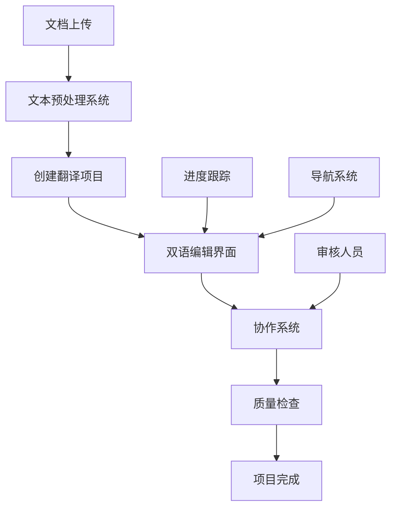

# 故事3: 双语编辑界面 - Story PRD

**版本**: 0.1
**更新时间**: 2024-07-04
**作者**: AI开发工程师
**状态**: 草稿
**关联 Version PRD**: [docs/product/prd/v1.0/strands-v1.0-version-prd.md](../strands-v1.0-version-prd.md)

## 1. 用户故事定义 (User Story Definition)

**用户故事 (Story):**
> 作为翻译人员，我想要在双语对照界面中编辑翻译，以便提高翻译质量

**验收标准 (Acceptance Criteria):**
- [AC-1] 系统能够提供完整的翻译工作台界面
- [AC-2] 翻译人员能够上传txt文档并创建翻译项目
- [AC-3] 系统能够集成文本预处理功能，自动清理和标准化文档
- [AC-4] 翻译人员能够在左右对照的界面中查看原文和编辑译文
- [AC-5] 系统能够实时保存翻译进度和编辑历史
- [AC-6] 翻译人员能够看到精确对照检查的问题提示
- [AC-7] 系统能够支持章节导航和快速定位
- [AC-8] 翻译人员能够邀请审核人员进行协作
- [AC-9] 系统能够提供翻译统计和进度跟踪
- [AC-10] 翻译人员能够导出或提交完成的翻译项目

## 2. 实施方案设计 (Proposed Implementation Design)

基于核心概念文档中的人工校对界面定义，以及已完成的故事9（文本预处理）和故事10（双语协作系统），本系统将实现完整的专业翻译工作台。

### 2.1 涉及的组件/模块 (Affected Components/Modules)

**前端页面组件 (`frontend/src/pages/`)**:
- `TranslationWorkspace.tsx`: 主翻译工作台页面
- `ProjectDashboard.tsx`: 项目仪表盘页面
- `DocumentUpload.tsx`: 文档上传页面
- `ProjectSettings.tsx`: 项目设置页面

**前端业务组件 (`frontend/src/components/business/`)**:
- `DocumentProcessor.tsx`: 文档预处理组件
- `TranslationEditor.tsx`: 翻译编辑器组件
- `NavigationPanel.tsx`: 章节导航面板
- `ProgressTracker.tsx`: 进度跟踪组件
- `QualityChecker.tsx`: 质量检查组件
- `CollaborationInvite.tsx`: 协作邀请组件

**前端UI组件 (`frontend/src/components/ui/`)**:
- `FileUploader.tsx`: 文件上传组件
- `ProgressBar.tsx`: 进度条组件
- `StatusBadge.tsx`: 状态标识组件
- `ActionButton.tsx`: 操作按钮组件

**状态管理 (`frontend/src/store/`)**:
- `projectStore.ts`: 项目状态管理
- `translationStore.ts`: 翻译状态管理
- `collaborationStore.ts`: 协作状态管理

**服务层 (`frontend/src/services/`)**:
- `projectService.ts`: 项目管理服务
- `translationService.ts`: 翻译服务
- `fileService.ts`: 文件处理服务

### 2.2 系统集成架构 (System Integration Architecture)

**集成已完成的系统**:
1. **故事9 - 文本预处理系统**: 文档上传后自动预处理
2. **故事10 - 双语协作系统**: 实时协作编辑功能

**数据流程**:


### 2.3 核心界面设计 (Core Interface Design)

**翻译工作台布局**:
```
┌─────────────────────────────────────────────────────────────┐
│ Header: 项目名称 | 进度 | 协作状态 | 设置                      │
├─────────────────────────────────────────────────────────────┤
│ Sidebar: 章节导航 | 进度跟踪 | 质量检查 | 协作面板              │
├─────────────────────────────────────────────────────────────┤
│ Main Editor:                                                │
│ ┌─────────────────┬─────────────────┬─────────────────────┐   │
│ │ 行号 │ English  │ 中文            │ 批注/问题           │   │
│ ├─────────────────┼─────────────────┼─────────────────────┤   │
│ │ 001  │ Hello    │ [可编辑]        │ [批注指示器]        │   │
│ │ 002  │ World    │ [可编辑]        │                     │   │
│ └─────────────────┴─────────────────┴─────────────────────┘   │
├─────────────────────────────────────────────────────────────┤
│ Footer: 统计信息 | 保存状态 | 操作按钮                        │
└─────────────────────────────────────────────────────────────┘
```

### 2.4 核心功能实现 (Core Feature Implementation)

**文档上传和预处理流程**:
```typescript
const handleDocumentUpload = async (file: File) => {
  // 1. 文件验证
  validateFile(file);
  
  // 2. 调用文本预处理API
  const preprocessResult = await documentService.preprocess({
    file_content: await file.text(),
    filename: file.name
  });
  
  // 3. 创建翻译项目
  const project = await projectService.create({
    name: file.name,
    original_content: preprocessResult.cleaned_content,
    metadata: preprocessResult.processing_report
  });
  
  // 4. 跳转到翻译工作台
  navigate(`/workspace/${project.id}`);
};
```

**翻译编辑器集成**:
```typescript
const TranslationEditor: React.FC<TranslationEditorProps> = ({
  projectId,
  originalContent,
  translationContent
}) => {
  // 集成协作系统
  const { sessionId, isConnected } = useCollaboration(projectId);
  
  // 集成双语编辑器
  return (
    <BilingualEditor
      sessionId={sessionId}
      initialEnContent={originalContent}
      initialCnContent={translationContent}
      currentUser={currentUser}
      onContentChange={handleTranslationChange}
    />
  );
};
```

**质量检查集成**:
```typescript
const useQualityCheck = (projectId: string) => {
  const [issues, setIssues] = useState<QualityIssue[]>([]);
  
  const runQualityCheck = async () => {
    // 调用精确对照检查
    const alignmentResult = await qualityService.checkAlignment(projectId);
    
    // 更新问题列表
    setIssues(alignmentResult.issues);
  };
  
  return { issues, runQualityCheck };
};
```

### 2.5 用户体验设计 (User Experience Design)

**工作流程优化**:
1. **快速开始**: 拖拽上传 → 自动预处理 → 立即开始翻译
2. **智能导航**: 章节跳转、搜索定位、书签功能
3. **实时反馈**: 自动保存、进度显示、质量提示
4. **协作便利**: 一键邀请、实时同步、批注交流

**响应式设计**:
```css
/* 桌面端 - 三栏布局 */
@media (min-width: 1200px) {
  .workspace {
    display: grid;
    grid-template-columns: 250px 1fr 300px;
    grid-template-areas: "sidebar editor panel";
  }
}

/* 平板端 - 可折叠侧边栏 */
@media (max-width: 1199px) {
  .workspace {
    display: grid;
    grid-template-columns: 1fr;
    grid-template-areas: "editor";
  }
  
  .sidebar {
    position: fixed;
    transform: translateX(-100%);
    transition: transform 0.3s ease;
  }
  
  .sidebar.open {
    transform: translateX(0);
  }
}

/* 移动端 - 单栏布局 */
@media (max-width: 768px) {
  .editor {
    flex-direction: column;
  }
  
  .english-column,
  .chinese-column {
    width: 100%;
  }
}
```

### 2.6 状态管理设计 (State Management Design)

**项目状态管理**:
```typescript
interface ProjectState {
  currentProject: Project | null;
  projects: Project[];
  isLoading: boolean;
  error: string | null;
}

interface TranslationState {
  originalContent: string[];
  translationContent: string[];
  editHistory: EditHistory[];
  unsavedChanges: boolean;
  lastSaved: Date | null;
}

interface CollaborationState {
  sessionId: string | null;
  activeUsers: User[];
  comments: Comment[];
  isConnected: boolean;
}
```

**状态同步策略**:
- 本地状态：编辑内容、UI状态
- 服务器状态：项目数据、协作状态
- 缓存策略：React Query + localStorage
- 冲突解决：服务器优先 + 用户确认

### 2.7 性能优化策略 (Performance Optimization)

**大文档处理**:
- 虚拟滚动：只渲染可见行
- 分页加载：按章节懒加载
- 防抖保存：编辑后500ms自动保存
- 内存管理：及时清理未使用组件

**网络优化**:
- API缓存：React Query缓存策略
- 增量同步：只传输变更内容
- 离线支持：本地存储 + 同步队列
- 预加载：预取下一章节内容

## 3. 测试计划 (Testing Plan)

### 3.1 单元测试
- 文档上传和预处理集成测试
- 翻译编辑器组件测试
- 状态管理逻辑测试
- 用户交互行为测试

### 3.2 集成测试
- 文本预处理系统集成测试
- 协作系统集成测试
- 端到端工作流程测试
- 多用户协作场景测试

### 3.3 用户体验测试
- 不同设备响应式测试
- 大文档性能测试
- 网络异常处理测试
- 用户操作流畅性测试

### 3.4 测试数据
- 基于《真正的朋友》项目的实际文档
- 不同大小和复杂度的测试文档
- 多用户协作测试场景
- 异常情况和边界条件测试

## 4. 性能要求 (Performance Requirements)

- 文档上传和预处理 < 5秒（10KB文档）
- 翻译工作台加载时间 < 2秒
- 编辑操作响应时间 < 100ms
- 大文档（1000+行）流畅滚动
- 支持同时编辑 >= 5个项目
- 离线模式下基本功能可用

## 5. 安全考虑 (Security Considerations)

- 用户身份验证和会话管理
- 项目访问权限控制
- 文件上传安全验证
- 数据传输加密
- 本地存储数据保护
- 协作权限管理

## 6. 可访问性要求 (Accessibility Requirements)

- 键盘导航支持
- 屏幕阅读器兼容
- 高对比度模式
- 字体大小调节
- 色盲友好设计
- 多语言界面支持

## 7. 部署和监控 (Deployment & Monitoring)

- 前端应用构建和部署
- CDN静态资源分发
- 用户行为分析
- 性能监控和优化
- 错误日志收集
- 用户反馈收集

---

**下一步**: 等待用户评审确认后开始具体实现
