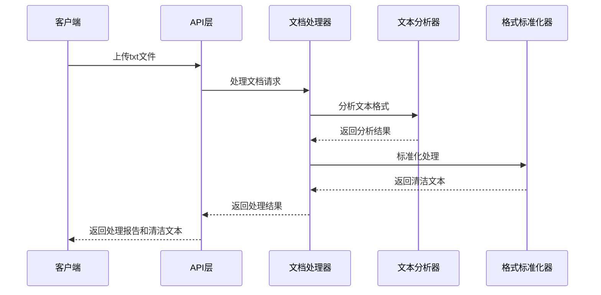

# 故事9: 文本预处理系统 - Story PRD

**版本**: 0.1
**更新时间**: 2024-07-04
**作者**: AI开发工程师
**状态**: 草稿
**关联 Version PRD**: [docs/product/prd/v1.0/strands-v1.0-version-prd.md](../strands-v1.0-version-prd.md)

## 1. 用户故事定义 (User Story Definition)

**用户故事 (Story):**
> 作为系统，我需要自动检查文本格式，以便确保处理质量

**验收标准 (Acceptance Criteria):**
- [AC-1] 系统能够自动检测txt文件的编码格式（UTF-8, GBK等）
- [AC-2] 系统能够统计和分析文本基本信息（总行数、空行数、内容行数）
- [AC-3] 系统能够识别和移除多余的空行，保留结构性空行
- [AC-4] 系统能够检测并合并被错误分割的段落
- [AC-5] 系统能够识别过短行（<10字符）和过长行（>200字符）
- [AC-6] 系统能够自动检测章节结构（CHAPTER标记）
- [AC-7] 系统能够生成标准化的清洁文本输出
- [AC-8] 系统能够提供详细的处理报告和统计信息

## 2. 实施方案设计 (Proposed Implementation Design)

基于核心概念文档中的文本预处理器定义和《真正的朋友》项目的实践经验，本系统将实现完整的文本预处理流程。

### 2.1 涉及的组件/模块 (Affected Components/Modules)

**后端服务层 (`backend/app/services/`)**:
- `document_processor.py`: 核心文档处理服务
- `text_analyzer.py`: 文本分析和统计服务
- `format_standardizer.py`: 格式标准化服务

**数据模型 (`backend/app/models/`)**:
- `Document`: 文档基本信息模型
- `ProcessingResult`: 处理结果模型

**API接口 (`backend/app/api/v1/endpoints/`)**:
- `documents.py`: 文档处理相关API端点

**工具函数 (`backend/app/utils/`)**:
- `text_utils.py`: 文本处理工具函数
- `encoding_detector.py`: 编码检测工具

### 2.2 数据获取与流程 (Data Fetching & Flow)

**数据来源**: 用户上传的txt文件
**处理方式**: 服务器端批处理
**核心流程**:

1. 文件上传和编码检测
2. 文本基本信息分析
3. 格式问题识别
4. 自动化清理和标准化
5. 生成处理报告

**流程图:**


### 2.3 核心算法设计 (Core Algorithm Design)

**文本分析算法**:
```python
def analyze_text_format(lines: List[str]) -> TextAnalysisResult:
    """
    分析文本格式的核心算法
    基于《真正的朋友》项目的实践经验
    """
    stats = {
        'total_lines': len(lines),
        'empty_lines': sum(1 for line in lines if not line.strip()),
        'content_lines': sum(1 for line in lines if line.strip()),
        'short_lines': sum(1 for line in lines if len(line.strip()) < 10),
        'long_lines': sum(1 for line in lines if len(line.strip()) > 200)
    }
    return TextAnalysisResult(**stats)
```

**格式标准化算法**:
```python
def standardize_format(lines: List[str]) -> List[str]:
    """
    格式标准化核心算法
    """
    cleaned_lines = []
    i = 0
    
    while i < len(lines):
        line = lines[i].strip()
        
        # 跳过空行
        if not line:
            i += 1
            continue
            
        # 检查是否需要与下一行合并
        if should_merge_with_next(line, lines, i):
            merged_line = merge_lines(lines[i:i+2])
            cleaned_lines.append(merged_line)
            i += 2
        else:
            cleaned_lines.append(line + '\n')
            i += 1
    
    return cleaned_lines
```

### 2.4 API接口设计 (API Interface Design)

**POST /api/v1/documents/preprocess**
```python
class DocumentPreprocessRequest(BaseModel):
    file_content: str
    filename: str
    encoding: Optional[str] = None

class DocumentPreprocessResponse(BaseModel):
    success: bool
    data: ProcessingResult
    message: str
    
class ProcessingResult(BaseModel):
    original_stats: TextStats
    cleaned_content: str
    processing_report: ProcessingReport
    issues_found: List[TextIssue]
```

### 2.5 错误处理策略 (Error Handling Strategy)

**异常类型**:
- `EncodingDetectionError`: 编码检测失败
- `TextProcessingError`: 文本处理异常
- `FileFormatError`: 文件格式不支持

**处理策略**:
- 编码检测失败时尝试常见编码
- 处理异常时保留原始文件
- 提供详细的错误信息和建议

## 3. 测试计划 (Testing Plan)

### 3.1 单元测试
- 文本分析算法测试
- 格式标准化算法测试
- 编码检测功能测试
- 章节识别功能测试

### 3.2 集成测试
- API接口完整流程测试
- 文件上传和处理集成测试
- 错误处理流程测试

### 3.3 测试数据
- 基于《真正的朋友》项目的实际案例
- 包含各种格式问题的测试文件
- 不同编码格式的测试文件

## 4. 性能要求 (Performance Requirements)

- 处理10KB文本文件 < 1秒
- 处理100KB文本文件 < 5秒
- 内存使用 < 50MB per request
- 支持并发处理 >= 10个请求

## 5. 安全考虑 (Security Considerations)

- 文件大小限制（最大10MB）
- 文件类型验证（仅支持.txt）
- 内容安全扫描（防止恶意代码）
- 临时文件自动清理

## 6. 部署和监控 (Deployment & Monitoring)

- 处理成功率监控
- 处理时间性能监控
- 错误类型统计
- 用户使用模式分析

---

**下一步**: 等待用户评审确认后开始具体实现
