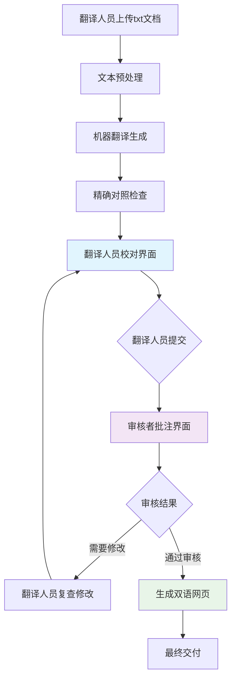

# Strands AI翻译工具 - Version PRD

**PRD 版本**: v1.0
**文档版本**: 1.0
**更新时间**: 2024-07-04
**作者**: 产品团队
**状态**: 草稿

## 1. 背景与目标 (Background & Goals)

### 1.1 项目背景

Strands AI翻译工具项目源于实际的翻译工作痛点。在《真正的朋友》双语对照项目的实践中，我们发现译文和原文对照核查过程极其耗时，缺乏高效的质量控制工具。专业翻译人员需要花费大量时间进行逐行对照、格式检查和质量验证，这严重影响了翻译效率和质量一致性。

目前市场上缺乏专门针对专业翻译质量控制的系统化工具，大多数现有工具要么功能过于简单，要么无法满足精确对照的专业需求。这为我们提供了填补市场空白的机会。

### 1.2 版本目标

**v1.0 MVP版本核心目标**：验证核心概念的可行性，构建完整的双语文本处理和质量控制流程。

**范围 (Scope):**

**In-Scope（本版本包含）:**
- 基础的文本预处理功能（格式检查、清理、标准化）
- 机器翻译集成（提供初始翻译基础）
- 精确对照检查核心功能（1:1行对应验证）
- 简化的人工校对界面（双语对照编辑）
- 基础的双语网页生成（标准化输出）

**Out-of-Scope（本版本不包含）:**
- 复杂的项目管理功能
- 高级的协作工作流
- 移动端支持
- 多语言对支持（仅支持英中双语）
- 高级的用户权限管理

### 1.3 核心用户价值

**目标用户**：翻译公司和学术机构的专业翻译人员

**核心价值**：
- **效率提升**：显著减少译文对照核查的时间成本
- **质量保障**：通过系统化的检查机制确保翻译质量
- **标准化输出**：生成符合专业标准的双语对照材料
- **流程优化**：建立可重复、可追溯的翻译质量控制流程

**成功标准**：能够辅助专业翻译人员快速提升翻译质量，验证核心技术方案的可行性。

## 2. 宏观设计 (Macro Design)

### 2.1 产品定位与平台 (Positioning & Platform)

**产品定位**：专业翻译质量控制工具，定位B2B市场，服务翻译公司和学术机构的专业翻译人员。

**目标平台**：
- **应用类型**：Web应用
- **服务模式**：SaaS服务
- **支持格式**：txt格式文档
- **处理模式**：实时处理

### 2.2 核心流程 (Core Flow)

核心用户旅程包含翻译人员和审核者的协作流程：

**流程说明**：
- **蓝色**：翻译人员主要工作界面
- **紫色**：审核者工作界面  
- **绿色**：最终输出

### 2.3 技术架构概览 (Tech Architecture Overview)

**前端技术栈**：
- React 18+ (用户界面框架)
- TypeScript (类型安全)
- Tailwind CSS (样式框架)
- Vite (构建工具)

**后端技术栈**：
- FastAPI (Python Web框架)
- SQLAlchemy (ORM)
- PostgreSQL (数据库)
- Redis (缓存)

**外部服务集成**：
- Google Translate API (机器翻译)
- OpenAI API (AI辅助翻译优化)
- 文件存储服务

### 2.4 关键指标 (Key Metrics)

**过程指标**：
- 文档处理成功率 (>95%)
- 对照检查准确率 (>98%)
- 系统响应时间 (<3秒)
- 用户界面加载时间 (<2秒)

**结果指标**：
- 翻译效率提升比例 (目标>50%)
- 用户满意度评分 (目标>4.0/5.0)
- 翻译质量改进程度 (通过用户反馈评估)
- 月活跃用户数 (MVP阶段目标>10个机构)

## 3. 版本规划 (Planning)

### 3.1 开发阶段与时间估算

**总开发周期**：3周

**阶段划分**：
- **第一阶段**：核心处理引擎开发（1周）
  - 文本预处理功能
  - 翻译API集成
  - 精确对照检查算法
- **第二阶段**：用户界面开发（1周）
  - React前端界面
  - 翻译人员工作台
  - 审核者批注界面
- **第三阶段**：集成测试和优化（1周）
  - 端到端测试
  - 性能优化
  - 用户体验调优

### 3.2 核心用户故事

基于版本目标和范围，将功能需求分解为以下用户故事：

#### 翻译人员故事 (Translator Stories)
1. **文档上传**: 作为翻译人员，我想要上传txt文档，以便开始翻译工作
2. **机器翻译查看**: 作为翻译人员，我想要看到机器翻译的初始结果，以便作为翻译起点
3. **双语编辑**: 作为翻译人员，我想要在双语对照界面中编辑翻译，以便提高翻译质量
4. **问题检测**: 作为翻译人员，我想要看到对照检查的问题提示，以便快速发现和修复问题
5. **翻译提交**: 作为翻译人员，我想要提交完成的翻译，以便进入审核流程

#### 审核者故事 (Reviewer Stories)
6. **翻译审核**: 作为审核者，我想要查看提交的翻译，以便进行质量评估
7. **批注功能**: 作为审核者，我想要对译文进行批注，以便给出具体的修改建议
8. **审核决策**: 作为审核者，我想要批准或退回翻译，以便控制质量流程

#### 系统功能故事 (System Stories)
9. **格式检查**: 作为系统，我需要自动检查文本格式，以便确保处理质量
10. **网页生成**: 作为系统，我需要生成双语对照网页，以便提供最终交付物

**故事优先级排序**：
- **P0 (核心功能)**: 故事1, 2, 3, 9, 10
- **P1 (重要功能)**: 故事4, 5, 6, 7
- **P2 (增强功能)**: 故事8

## 4. 概要设计 (Outline Design)

### 4.1 功能模块设计

基于核心概念和用户故事，系统划分为以下主要功能模块：

1. **文档管理模块** - 文件上传、项目管理
2. **翻译处理模块** - 机器翻译、文本预处理  
3. **对照检查模块** - 精确对照验证、问题检测
4. **协作校对模块** - 翻译编辑、审核批注
5. **输出生成模块** - 双语网页生成

### 4.2 页面结构设计

**翻译人员界面**：
- 项目列表页 - 显示所有翻译项目和状态
- 文档上传页 - txt文件上传和项目创建
- 翻译工作台 - 核心双语编辑界面
- 项目状态页 - 查看项目进度和审核反馈

**审核者界面**：
- 待审核列表页 - 显示需要审核的翻译项目
- 审核工作台 - 双语对照审核和批注界面
- 批注管理页 - 管理历史批注和反馈

**共用页面**：
- 登录/注册页 - 用户身份验证
- 用户设置页 - 个人信息和偏好设置
- 帮助文档页 - 使用指南和FAQ

### 4.3 核心功能清单

**文档处理功能**：
- txt文件上传和解析
- 文本格式检查和清理
- 章节结构识别
- 编码格式自动检测

**翻译功能**：
- Google Translate API集成
- OpenAI翻译优化
- 批量翻译处理
- 翻译质量评估

**对照检查功能**：
- 1:1行对应验证
- 对话合并检测
- 内容缺失检测
- 段落分割错误识别

**协作功能**：
- 实时编辑保存
- 批注和评论系统
- 版本历史追踪
- 用户角色权限管理

**输出功能**：
- 双语网页模板生成
- 响应式布局适配
- HTML/CSS标准化输出
- 章节导航和搜索功能

## 5. 交付设计 (Delivery Design)

### 5.1 数据分析

**用户行为数据埋点**：
- 文档上传成功率和失败原因
- 翻译编辑时长和编辑次数
- 审核批注频率和类型分布
- 页面停留时间和用户路径

**业务指标数据**：
- 翻译项目完成率
- 用户满意度评分
- 系统错误率和响应时间
- API调用成功率和成本统计

**关键数据报表**：
- 日活跃用户统计
- 翻译质量改进趋势
- 系统性能监控面板
- 用户反馈汇总报告

### 5.2 上线筹备

**技术配置优先级**：
1. **P0**: 核心功能实现和测试
2. **P1**: 基础服务器环境和数据库配置
3. **P1**: API服务集成（Google Translate, OpenAI）
4. **P2**: SSL证书和域名设置

**运营准备**：
- 简化的用户注册流程
- 基础使用文档
- 核心功能演示视频
- 问题反馈渠道

**基础风险预案**：
- API服务备用方案（多服务商支持）
- 数据定期备份机制
- 基础系统监控告警

## 6. 技术债务管理 (Tech Debt Management)

### 6.1 预期技术债务

为了快速验证v1.0 MVP概念，以下技术债务是可接受的：

**简化实现项**：
- 简化的用户权限系统（后续需要完善RBAC权限控制）
- 基础的错误处理机制（需要更完善的异常处理和用户提示）
- 单一翻译API依赖（需要增加备用翻译服务方案）
- 基础的并发处理（后续需要优化高并发场景）

**标记方式**：
- 代码中使用 `// TODO: Tech Debt - [描述]` 标记
- 在项目backlog中创建对应的优化任务
- 定期评估和偿还技术债务

### 6.2 债务偿还计划

**v1.1版本计划偿还**：
- 完善用户权限系统
- 增加翻译API备用方案

**v1.2版本计划偿还**：
- 优化错误处理机制
- 提升系统并发性能

## 7. 未来展望 (Future Considerations)

### 7.1 功能扩展方向

**v1.x系列规划**：
- 支持更多文档格式（docx, pdf, epub）
- 多语言对支持（英法、英德、中日等）
- 高级协作工作流（多人协作、任务分配）
- AI翻译质量自动评估和建议

**v2.x系列展望**：
- 移动端应用开发
- 企业级项目管理功能
- 翻译记忆库集成
- 专业术语库管理

### 7.2 技术演进方向

- 微服务架构重构
- 实时协作技术升级
- AI模型本地化部署
- 性能和扩展性优化

## 8. 附录 (Appendix)

### 8.1 相关文档链接

- **核心概念文档**: `docs/product/core-concepts.md`
- **开发指南**: `doc/双语文本对照处理系统开发指南.md`
- **项目参考**: 《真正的朋友》双语对照项目实践经验

### 8.2 术语表 (Glossary)

- **精确对照**: 英文和中文文本实现完美的1:1行对应关系验证
- **双语校对**: 原文和译文的对照编辑和质量控制过程
- **机器翻译**: 基于AI的自动翻译服务，作为人工翻译的起点
- **批注系统**: 审核者对译文进行标注和评价的功能模块
- **SaaS服务**: Software as a Service，基于云端的软件服务模式

### 8.3 版本记录

| 版本 | 日期 | 作者 | 变更说明 |
|------|------|------|----------|
| 1.0 | 2024-07-04 | 产品团队 | 初始版本，完成v1.0 MVP需求定义 |

---

**文档状态**: 已定稿  
**下一步**: 基于PRD创建开发指南和Story PRD
